# 📚 Portfólio — Engenharia de Software | FIAP 2026

## Sobre este repositório

Este repositório reúne os exercícios individuais do Checkpoint 3 de Engenharia de Software. O objetivo é documentar a evolução prática nas aulas de requisitos, SRS, UML, arquitetura MVC e implementação em Python.

Cada pasta representa uma aula e contém os arquivos solicitados: código-fonte, diagramas quando aplicável e prints da execução dos programas.

## Como executar os exercícios

### Pré-requisitos

- Python 3.10 ou superior
- Git instalado
- Terminal ou prompt de comando

### Instalação

Clone o repositório e acesse a pasta do projeto:

```bash
git clone <url-do-repositorio>
cd checkpoint-3-engenharia-software
```

Execute qualquer exercício com:

```bash
python3 aula-03-requisitos/gymtrack_validador.py
```

## Exercícios por Aula

### Aula 03 — Requisitos Funcionais vs. Não-Funcionais

#### 💻 Código

Arquivo: `aula-03-requisitos/gymtrack_validador.py`

O código implementa um validador de treinos para o GymTrack, verificando dados obrigatórios, duração, intensidade e frequência cardíaca. O exercício reforça a diferença entre regras funcionais do sistema e critérios de qualidade como clareza das mensagens e validação de entrada.

#### 🖥️ Execução

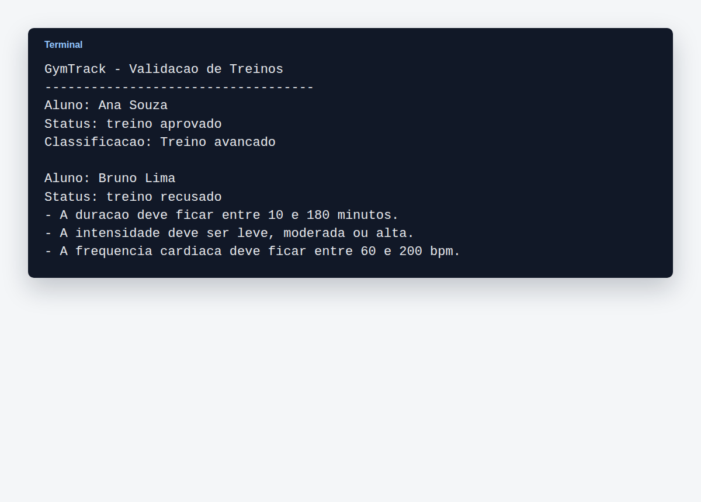

O print mostra um treino aprovado e outro recusado, evidenciando as validações aplicadas pelo programa.

### Aula 04 — Documento SRS

#### 💻 Código

Arquivo: `aula-04-srs/srs_marketplace.py`

O programa organiza requisitos do FIAP Marketplace em formato estruturado, com código, tipo, prioridade e critério de aceite. A atividade demonstra como transformar necessidades de negócio em requisitos rastreáveis.

#### 🖥️ Execução

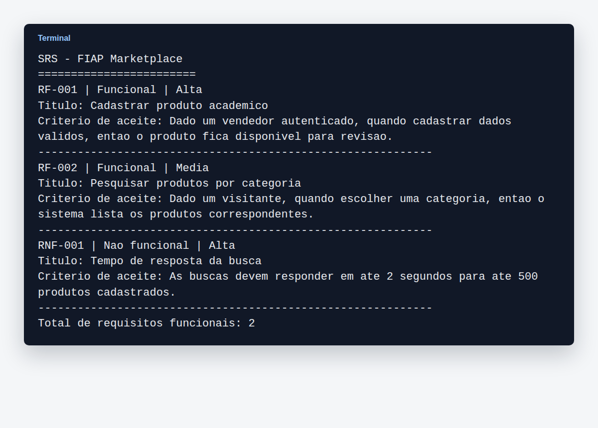

O output apresenta os requisitos cadastrados e a contagem de requisitos funcionais.

### Aula 05 — UML e Casos de Uso

#### 📐 Diagrama

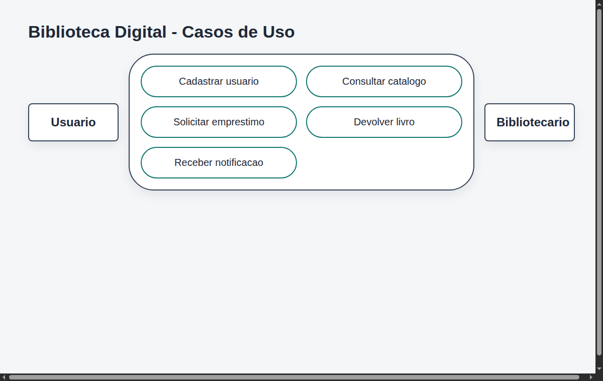

O diagrama representa as interações entre usuário, bibliotecário e sistema da Biblioteca Digital. Os casos de uso priorizam cadastro, consulta, empréstimo e devolução de livros.

#### 💻 Código

Arquivo: `aula-05-casos-de-uso/biblioteca_digital.py`

A implementação traduz os casos de uso em métodos de uma biblioteca digital. Foram aplicadas classes simples, controle de disponibilidade e mensagens para fluxos de sucesso e erro.

#### 🖥️ Execução

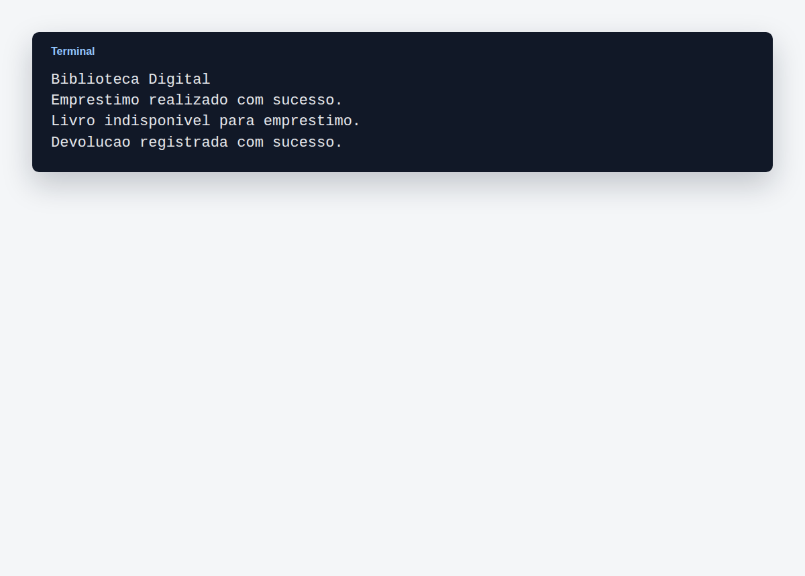

O print demonstra o empréstimo, a tentativa de novo empréstimo com o livro indisponível e a devolução.

### Aula 06 — Diagramas de Atividades

#### 📐 Diagrama

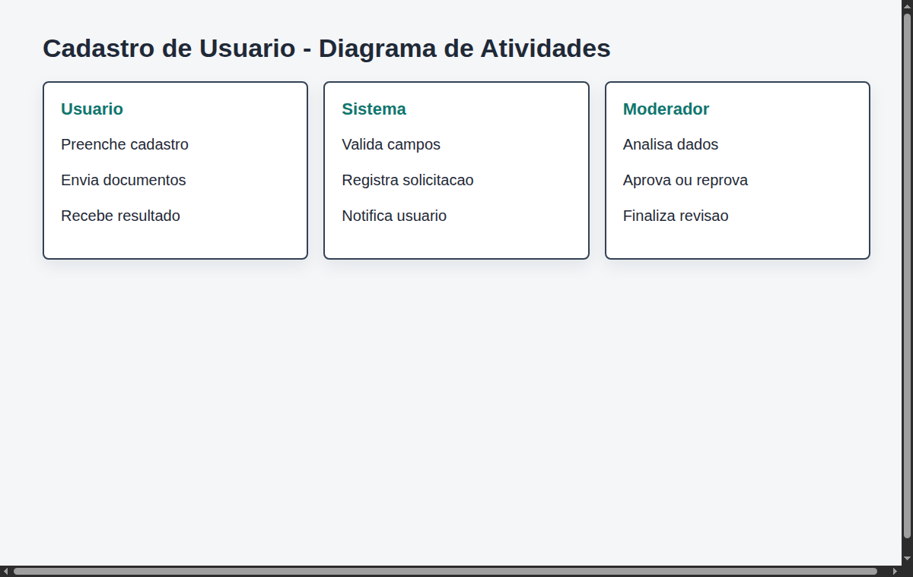

O diagrama usa swimlanes para separar responsabilidades entre usuário, sistema e moderador. O fluxo evidencia validação de dados, análise e comunicação do resultado.

#### 💻 Código

Arquivo: `aula-06-atividades/cadastro_usuario.py`

O código simula o processo de cadastro e aprovação de usuário. A atividade mostra como regras de validação podem ser derivadas de um fluxo de atividades.

#### 🖥️ Execução

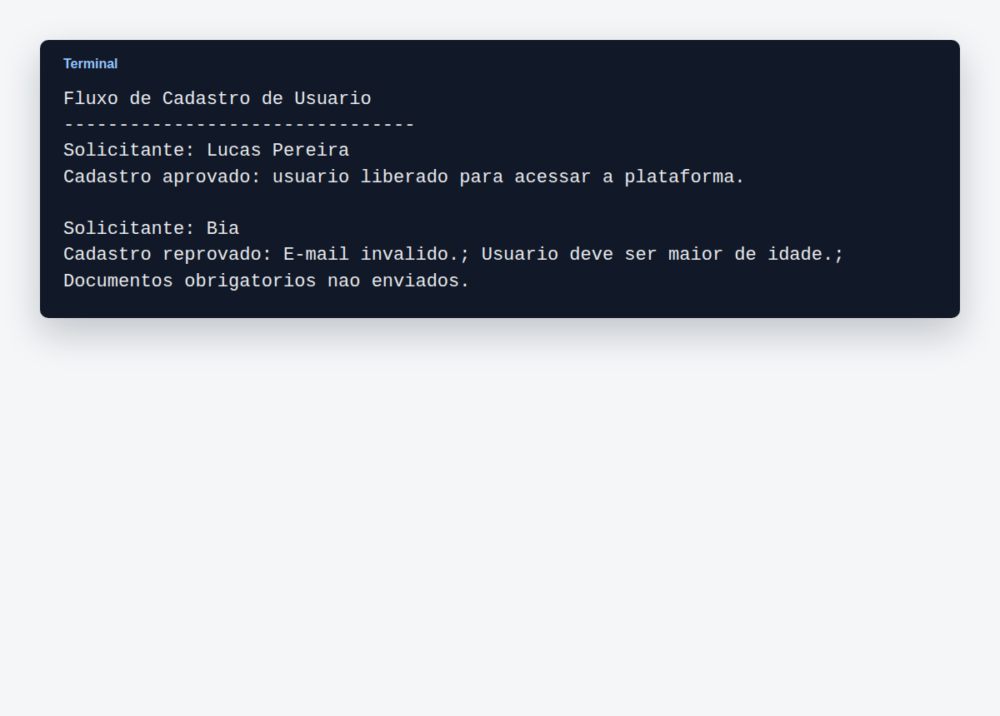

O output exibe um cadastro aprovado e outro reprovado com os motivos da recusa.

### Aula 07 — Diagramas de Sequência

#### 📐 Diagrama

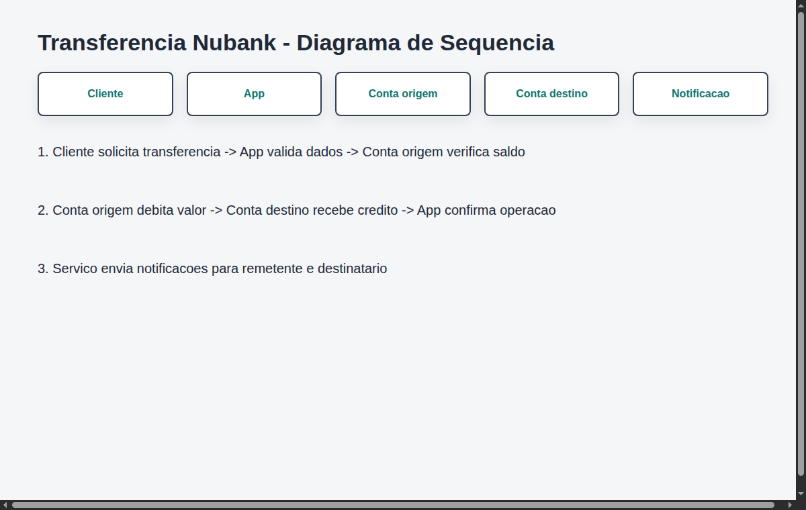

O diagrama descreve a ordem das mensagens entre cliente, aplicativo, conta de origem, conta de destino e serviço de notificação. A modelagem destaca validação de saldo, débito, crédito e confirmação.

#### 💻 Código

Arquivo: `aula-07-sequencia/transferencia_nubank.py`

A implementação reproduz a sequência de uma transferência bancária. O exercício reforça a comunicação entre objetos e a importância de validar regras antes de concluir uma operação financeira.

#### 🖥️ Execução

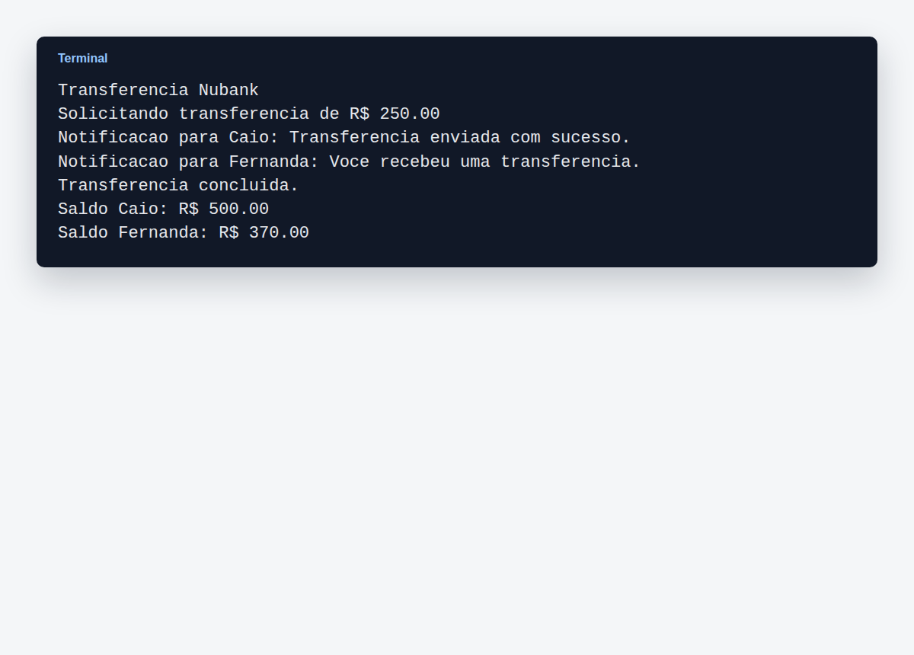

O print mostra a transferência concluída, notificações enviadas e saldos atualizados.

### Aula 08 — Diagramas de Classes

#### 📐 Diagrama

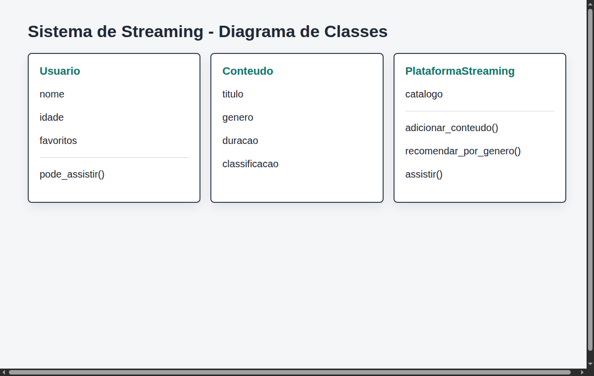

O diagrama apresenta as classes principais de um sistema de streaming: usuário, conteúdo e plataforma. Os relacionamentos mostram catálogo, favoritos, recomendação e controle por classificação indicativa.

#### 💻 Código

Arquivo: `aula-08-classes/streaming_netflix.py`

O código implementa as classes modeladas no diagrama e simula a reprodução de conteúdo. Também inclui recomendação por gênero e validação de classificação indicativa.

#### 🖥️ Execução

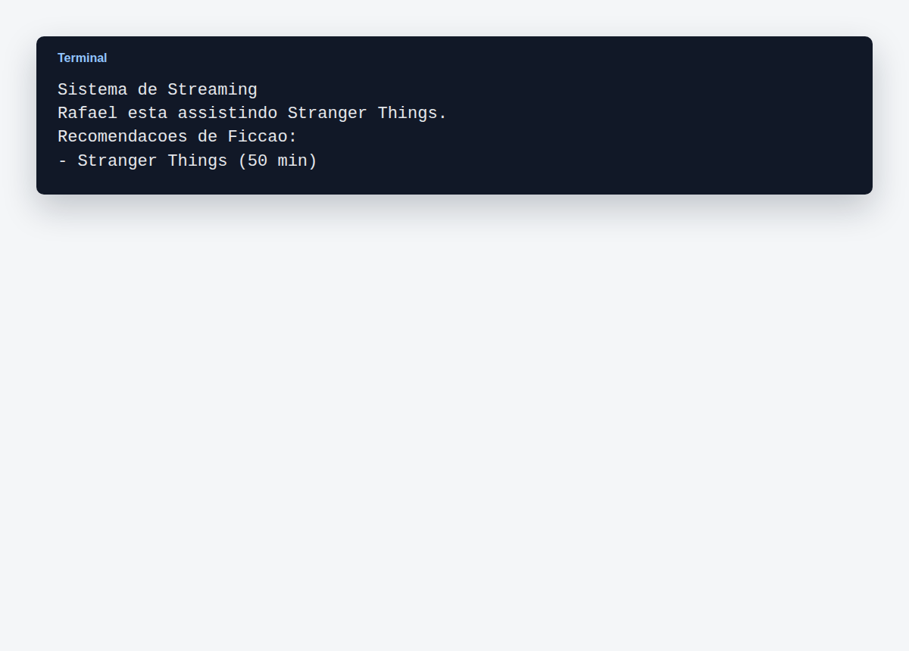

O output demonstra um usuário assistindo a um conteúdo e a listagem de recomendações por gênero.

### Aula 09 — Arquitetura MVC

#### 💻 Imagens

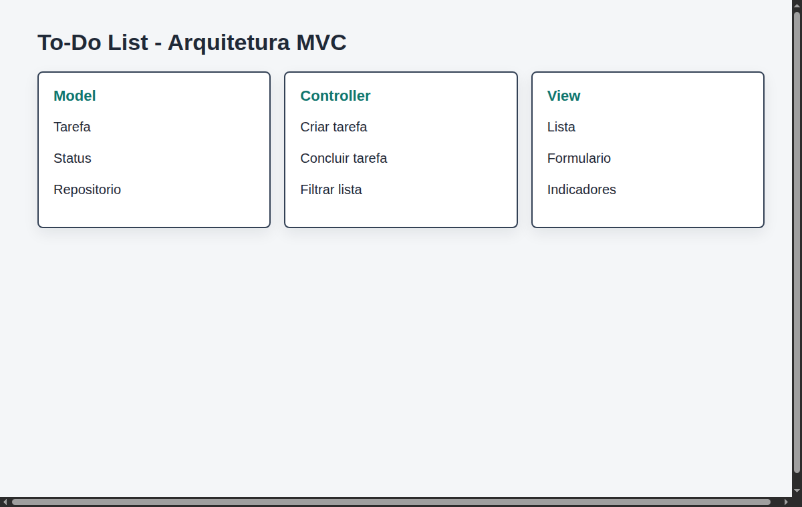

A imagem apresenta a separação entre Model, View e Controller em uma To-Do List. A arquitetura organiza responsabilidades para evitar mistura entre regra de negócio, interface e controle de eventos.

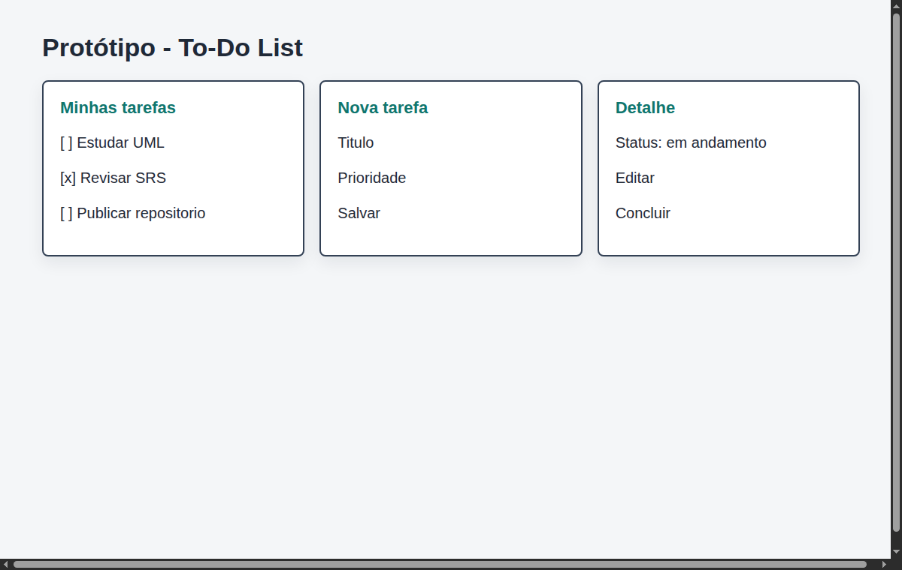

O protótipo mostra telas principais da aplicação de tarefas, incluindo lista, criação e alteração de status. A proposta visual complementa a arquitetura MVC com uma visão de interface.

## Links

- Repositório GitHub: https://github.com/CaioTSFaraleski/CursoEngenhariaSoftware
- Curso: Engenharia de Computação - FIAP
- Disciplina: Engenharia de Software
